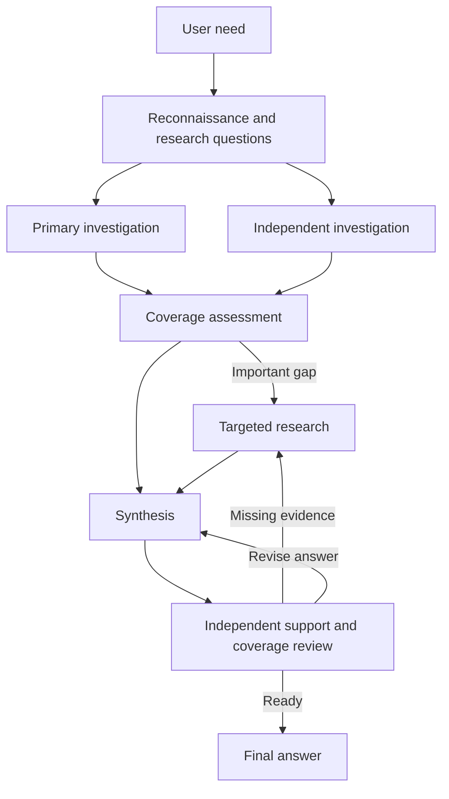

# Question-driven multi-agent research

The goal is more correct, complete and useful research than a capable single agent.
Separate sessions are an experimental means to that goal, not a quality metric.
The `multi_agent` policy combines source-informed question discovery, independent
investigation, synthesis and evidence-driven review. `question_driven` applies the
same research-method guidance in one session as a control.

## Research basis and limits

- [STORM](https://arxiv.org/abs/2402.14207) motivates source-informed perspectives,
  question asking and research before writing. It does not prove an optimal agent count.
- [Co-STORM](https://arxiv.org/abs/2408.15232) motivates discovering overlooked needs
  and revising the inquiry. Its interactive learning results do not establish transfer
  to an autonomous service.
- [Crucible](https://aclanthology.org/2026.rag4reports-1.10/) organizes generation around
  question nuggets and supporting passages. Its extractive results caution against
  removing useful information outside a narrowly framed question. Its cited submission
  uses one-shot retrieval, not this multi-agent controller.
- [OpenScholar](https://arxiv.org/abs/2411.14199) motivates feedback that can retrieve
  missing evidence before revision, followed by citation checking. Its self-feedback
  results do not establish that an independent reviewer is superior.

This implementation is an adaptation of those mechanisms, not a reproduction or a
claim of equivalent benchmark performance. Questions are revisable information needs,
not benchmark reference answers or facts. Source excerpts remain separate from findings.

## Execution and handoffs

The initial investigations receive the same reconnaissance context and complementary
assignments. They execute sequentially in distinct Codex sessions, so the configured
worker capacity need not increase. The independent researcher cannot read the primary
researcher's retained materials through the source adapter. Both contributions reach
coverage assessment. Conflicting answers remain available for reconciliation.

All roles have source access. Coverage assessment and review can request further
research; research can add questions. Synthesis and review see the complete working
draft and question/finding handoffs. The context allowance selects additional source
excerpts; required handoffs and the complete draft are not truncated to that allowance.
Full retrieved material remains available through source tools.

The controller requires the initial investigations and review before completion. Time,
assignment or source exhaustion preserves partial work and is not approved completion.
The source allowance is aggregate across assignments; it is not multiplied per agent.
There is no mandatory disagreement and no fixed number of review corrections. The
request's overall limits remain authoritative. Extend an evaluation's allowances in a
new run when a cap prevents useful completion; retain the original attempt.

## Materialized work

For every live assignment, the existing private worker directory contains:

- `assignment.json`: the actual objective, role, focus, supplied context and allowances;
- `prompt.txt`: exact research instructions sent to the runtime;
- `result.json`: the returned questions, findings, excerpts, draft and next action,
  with runtime-observed session identity, elapsed time and usage;
- `findings.md`: a readable rendering of the research handoff;
- `worker.json`: runtime session and terminal outcome, including failure;
- `sources/`: retained source material from that assignment.

Inputs are written before launch and successful returns before the next handoff.
Each assignment has its own directory, so revisions remain inspectable. Failed workers
retain their input, available source files and terminal outcome, but may have no
structured research return. These are research work products, not hidden reasoning or
an immutable accounting system. Treat them as private data under the existing retention
policy. Restate remains responsible for durable execution; files are not a scheduler.

## Verify before interpreting scores

Prepare published cases with `--policy multi_agent` using the benchmark CLI. Running
those cases compares `multi_agent`, `question_driven` and `single_session`. Each uses
the same model, source access and total per-case limits. A single-session override is
rejected for `multi_agent`. The historical `perspective` arm is a policy-guidance
comparison and must not be described as proof of multi-agent behavior.

`evaluation.json` includes observed assignment roles, sessions, elapsed time and outcomes.
`workflow_verified` requires completed execution, distinct observed sessions and the
required roles in order. It establishes structural execution only, not correct research
or independent model-family judgment. Fixture runs lacking session evidence cannot
qualify as live multi-agent runs. Inspect actual handoffs and sources as well.

A controlled fixture demonstrates a reviewer requesting missing evidence, follow-up
research obtaining it, and synthesis incorporating it. That fixture is not a quality
benchmark. Live quality must be judged from anonymized answers against the existing
published task criteria, including consequential citation support and missed information.
Report individual benchmark scores, incomplete attempts, aggregate usage and wall time.
A small pilot cannot establish general superiority. Keep production defaults unchanged
until comparative evidence supports changing them.
