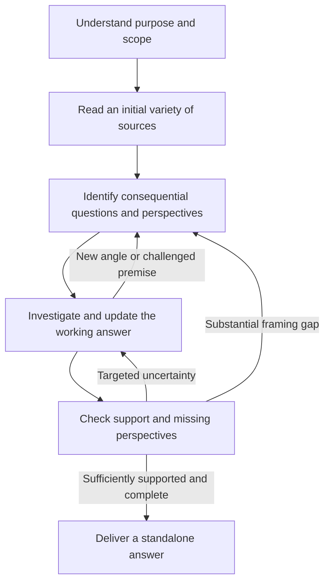

# Perspective research experiment

The experiment asks whether domain-sensitive inquiry expansion produces a more useful,
correct answer than the ordinary single-session research agent. It does not ask whether
more viewpoints, longer answers or additional model sessions are inherently better.
The `perspective` policy builds on adaptive source access and mutable questions. The
production default remains unchanged pending evidence.

## Research behavior

Perspective depends on the task. For a bolt-fit question, it can mean an overlooked
material compatibility problem. For scientific research, it can mean another mechanism
or evidence that limits transfer. For policy, it can mean a different affected group,
objective or time horizon. A precise factual question need not become a debate.

Initial ideas are hypotheses for investigation. Reading can change, retire or add
questions. The researcher must distinguish evidence that a view exists from evidence
that its claims are true, attribute real proponents, and weight conclusions by support.
It can challenge the user's framing when the issue could affect the requested outcome.
All activities can consult sources. The existing questions and findings are sufficient
working notes; no new ledger, provenance service or claim database is introduced.

## Frozen initial comparison

The [six cases](../evals/perspectives/cases.json) and separate
[reference requirements](../evals/perspectives/reference.json) are frozen before live
execution. All are development cases; none is advertised as an untouched held-out test.

| Case | What it tests |
| --- | --- |
| Marine fastener | Notice a consequential technical constraint beyond nominal fit |
| SQLite direct answer | Stay concise when an exact question has an established answer |
| Office policy | Compare measured outcomes and task-specific counterevidence |
| Rent policy | Distinguish affected groups, empirical results and normative objectives |
| Long context | Investigate alternatives to the apparent retrieval/context binary |
| Citation gate | Challenge a plausible but insufficient criterion for correctness |

Both arms use the same model, reasoning effort, Kagi tools and twenty-minute allowance,
with the same configured source allowance. `single_session_policy` keeps each arm in
one complete-research assignment. The perspective arm receives the new guidance and
adaptive working-question guidance; the control receives neither. Therefore this is a
comparison of the combined policy, not an isolated estimate of the perspective paragraph's
effect beyond the earlier adaptive policy. An adaptive-only ablation can answer that
separate question if these results justify it.

The runner alternates arm order across cases. Preserve failed and partial attempts,
report runtime separately from quality, and extend paired allowances if a limit actually
prevents useful completion. Never discard a slow answer or treat a capped result as the
workflow's quality ceiling. Observed MCP events do not measure exact upstream query counts,
and recorded tokens do not establish subscription quota consumption.

The user requested an independent reviewer outside the research workflow. A fresh
sub-agent receives anonymized requests and answers, without conversation history,
implementation, policy names, timing or the author's preferred conclusion. It first
records an assessment of usefulness, correctness and missing material, then uses the
reference requirements to provide inspectable scores. It can verify sources through
Kagi. It also flags valid answers unfairly penalized by a reference and important
findings outside it. After quality judgments are saved, a separate packet of observable
tool activity and runtime supports process assessment. Neither researcher receives this
review or uses it to revise its answer during the experiment. This is independent context,
not independent model-family or human validation.

Use the existing scorer to aggregate reviewer judgments. Each requirement earns 0–2
points; consequential errors remain separate. Do not reward verbosity, a particular
political conclusion, invented disagreement, or citations whose passages do not support
the claims. Inspect important differences rather than declaring a winner from small
changes in a tiny sample. A useful improvement must survive checks for introduced errors,
missing qualifications, irrelevant breadth and actual benefit to the user's purpose.

## Research basis

[STORM](https://arxiv.org/abs/2402.14207) motivates source-informed perspective and
question discovery; its ablations do not establish this prompt's effectiveness with
this runtime. [WebWeaver](https://arxiv.org/abs/2509.13312) motivates retrievable evidence
during writing. [TTD-DR](https://arxiv.org/abs/2507.16075) motivates evidence-guided
revision rather than mandatory editorial passes. These ideas are hypotheses tested by
the experiment, not claims that this implementation reproduces those systems.
